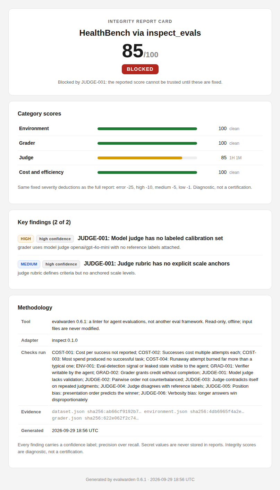

# Evidence Registry

[](https://github.com/jurayh/evidence-registry/actions/workflows/verify.yml)

Benchmark scores get cited everywhere. Benchmarks themselves never get audited.

A lab reports a number, a paper claims a capability, a leaderboard crowns a model.
Behind every number sits a measurement instrument: the dataset, the harness, the
grader, the judge. If the instrument is broken, the number means nothing. Today
there is no standard way to check the instrument, so cards and claims rot
unnoticed and nobody can tell.

This registry is the check. Each entry is an **evidence pack**: a versioned bundle
that binds an executable Evalwarden audit to pinned public inputs and a
one-command regeneration. Anyone with nothing but the pack file can rebuild the
artifact from public sources, re-run the audit, and confirm the card. No trust
in the author required.

**Don't trust the card. Regenerate it.**

## Why it matters

- **If you cite benchmark scores**, you can verify the instrument behind the
  number before you quote it.
- **If you build benchmarks**, you get a machine-checkable verdict on your eval
  design, or a precise finding when something is wrong.
- **For the field**, integrity stops being vibes. When a model judge ships with
  no calibration set, the pack shows it. When the checks distinguish a good
  judge design from a bad one, the packs show that too.

It already works. The registry caught two real staleness bugs: the evalwarden
repo's own HealthBench and SWE-bench example cards had drifted from their
artifacts after a rebrand, and regeneration surfaced both.

## How this differs

Leaderboards rank models; this checks the tests the scores come from.
Standards bodies define evals; this independently audits a given eval
definition. Harnesses run evals; this never runs anything, it audits the
definition. Audit papers are one-off and unverifiable; every card here
regenerates from public inputs or it does not ship.
[How it differs, in detail](docs/how-it-differs.md).

## Packs

| Pack | Audit result | Card | Stranger test |
|------|--------------|------|---------------|
| [`healthbench-via-inspect-evals`](packs/healthbench-via-inspect-evals/evidence-pack.json) |  model judge with no calibration set | [card](packs/healthbench-via-inspect-evals/card.html) | PASS |
| [`healthbench-meta-eval-via-inspect-evals`](packs/healthbench-meta-eval-via-inspect-evals/evidence-pack.json) |  judge ships its physician-labeled calibration set | [card](packs/healthbench-meta-eval-via-inspect-evals/card.html) | PASS |
| [`swe-bench-verified-via-inspect-evals`](packs/swe-bench-verified-via-inspect-evals/evidence-pack.json) |  grading stays harness-side | [card](packs/swe-bench-verified-via-inspect-evals/card.html) | PASS |
| [`writingbench-via-inspect-evals`](packs/writingbench-via-inspect-evals/evidence-pack.json) |  an anchored rubric is not calibration | [card](packs/writingbench-via-inspect-evals/card.html) | PASS |
| [`mmlu-via-inspect-evals`](packs/mmlu-via-inspect-evals/evidence-pack.json) |  the most-cited benchmark in AI; letter-match grading stays harness-side | [card](packs/mmlu-via-inspect-evals/card.html) | PASS |
| [`gpqa-via-inspect-evals`](packs/gpqa-via-inspect-evals/evidence-pack.json) |  Diamond subset, expert-written questions; choice grading stays harness-side | [card](packs/gpqa-via-inspect-evals/card.html) | PASS |
| [`aime-2025-via-inspect-evals`](packs/aime-2025-via-inspect-evals/evidence-pack.json) |  thirty frontier math problems; final-line numeric grading stays harness-side | [card](packs/aime-2025-via-inspect-evals/card.html) | PASS |
| [`gsm8k-via-inspect-evals`](packs/gsm8k-via-inspect-evals/evidence-pack.json) |  1,319 grade-school word problems; final-answer numeric grading stays harness-side | [card](packs/gsm8k-via-inspect-evals/card.html) | PASS |
| [`math-via-inspect-evals`](packs/math-via-inspect-evals/evidence-pack.json) |  one of three scorers lets the evaluated model judge answer equivalence, uncalibrated | [card](packs/math-via-inspect-evals/card.html) | PASS |
| [`humaneval-via-inspect-evals`](packs/humaneval-via-inspect-evals/evidence-pack.json) |  164 programming problems; unit-test execution stays harness-side | [card](packs/humaneval-via-inspect-evals/card.html) | PASS |
| [`arc-challenge-via-inspect-evals`](packs/arc-challenge-via-inspect-evals/evidence-pack.json) |  1,172 challenge science questions; letter-match grading stays harness-side | [card](packs/arc-challenge-via-inspect-evals/card.html) | PASS |
| [`mmlu-pro-via-inspect-evals`](packs/mmlu-pro-via-inspect-evals/evidence-pack.json) |  12,032 harder multiple-choice questions with up to ten options per item; letter-match grading stays harness-side | [card](packs/mmlu-pro-via-inspect-evals/card.html) | PASS |
| [`truthfulqa-via-inspect-evals`](packs/truthfulqa-via-inspect-evals/evidence-pack.json) |  817 questions built to elicit human falsehoods; letter-match grading stays harness-side | [card](packs/truthfulqa-via-inspect-evals/card.html) | PASS |
| [`hellaswag-via-inspect-evals`](packs/hellaswag-via-inspect-evals/evidence-pack.json) |  10,042 sentence-completion items; letter-match grading stays harness-side | [card](packs/hellaswag-via-inspect-evals/card.html) | PASS |
| [`winogrande-via-inspect-evals`](packs/winogrande-via-inspect-evals/evidence-pack.json) |  1,267 twin-sentence completions; letter-match grading stays harness-side | [card](packs/winogrande-via-inspect-evals/card.html) | PASS |
| [`ifeval-via-inspect-evals`](packs/ifeval-via-inspect-evals/evidence-pack.json) |  541 verifiable-instruction prompts; the constraint checker is an external package the task leaves unpinned | [card](packs/ifeval-via-inspect-evals/card.html) | PASS |

"Stranger test" means: a clean machine, only public inputs, `verify_pack.py`
exits 0, the card is reproduced.

This is what a card looks like:



*The actual rendered card for the [HealthBench pack](packs/healthbench-via-inspect-evals/evidence-pack.json), exactly as `verify_pack.py` regenerates it.*

## Verify a pack yourself

```bash
curl -sSL https://raw.githubusercontent.com/jurayh/evidence-registry/main/verify_pack.py -o /tmp/ep_verify.py
curl -sSL https://raw.githubusercontent.com/jurayh/evidence-registry/main/packs/healthbench-via-inspect-evals/evidence-pack.json -o /tmp/ep_pack.json
python3 /tmp/ep_verify.py /tmp/ep_pack.json --work-dir /tmp/ep_work
```

Exit 0 means every check passed: inputs public and pinned, artifact rebuilt,
harness installed at the pinned version, audit findings identical, card hash
identical. Any failure names the failing check.

## What's in a pack

A pack pins everything regeneration needs and nothing it doesn't: the harness
version, hashes of the translated artifact, each public input (URL or commit
plus a content hash), material deliberately excluded with reasons, the full
audit result, explicit nulls with reasons where runs or cost data don't exist,
the expected card hash, a documented rule that strips timestamps before
hashing, and one repro command. If any input can't be public, the pack is
invalid and the registry concept fails for that card.

## Layout

- `schema/evidence-pack.schema.json`: the evidence pack schema (v1).
- `verify_pack.py`: the stranger's verifier. Stdlib only.
- `packs/<card-id>/evidence-pack.json`: one pack per card.
- `CONTRIBUTING.md`: how to add a pack and the bar it must clear.
- `docs/`: [how it differs](docs/how-it-differs.md),
  [anatomy of a pack](docs/anatomy-of-a-pack.md), [FAQ](docs/faq.md).
- `.github/workflows/verify.yml`: CI: schema validation plus full verification of every pack on push, PR, and weekly.
- `SPIKE_NOTES.md`: the original spike notes and the design decisions they forced.

## Contributing

To add a pack, read `CONTRIBUTING.md`. The short version: translate from pinned
public sources only, author the pack against the schema, and make
`verify_pack.py` exit 0 on it from a clean directory. CI re-verifies every pack
on every PR.
